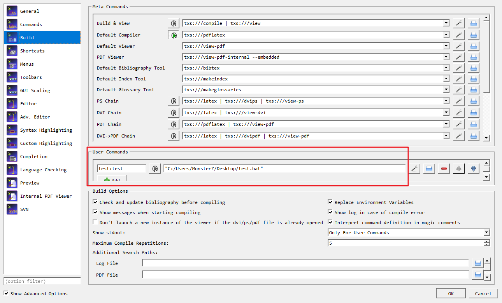
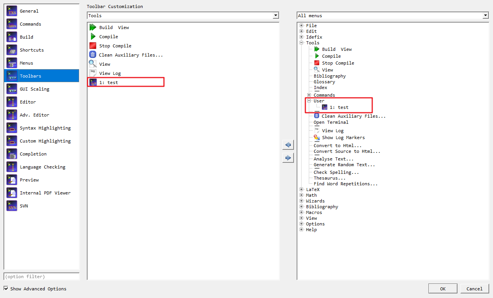
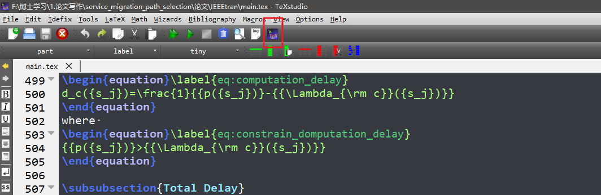

# 如何在texstudio中加入bibPorter

## 引入功能
option-->configure-->build-->user command

写入指定的脚本路径。

此处也可以直接写需要执行的命令，[原贴地址](https://sourceforge.net/p/texstudio/discussion/907840/thread/f2b1d9fd/)

eg：

```bash
cmd /c "git describe --dirty > gitVersion.tex"
```




## 增加快捷键
option-->configure-->toolbar
左边选择Tools
右面选择All menu，然后在Tools-->user中找到刚刚设置的脚本，增加到左侧

## 最终效果：

